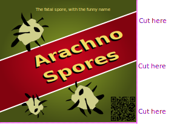

# Arachno Spores label

A label to stick over a bottle of fly spray (or similar) to make it look like a bottle of [Arachno Spores](https://futurama.fandom.com/wiki/Arachno_Spores).

## Dimensions

I measured a bottle of fly spray and used those dimensions to create the label. At the area on the bottle where the label would go, the bottle was 202 mm tall and had a diameter of 66mm; giving a circumference of 207.3 mm. The label is 225 mm wide, to allow for overlap when wrapping it around the bottle.
